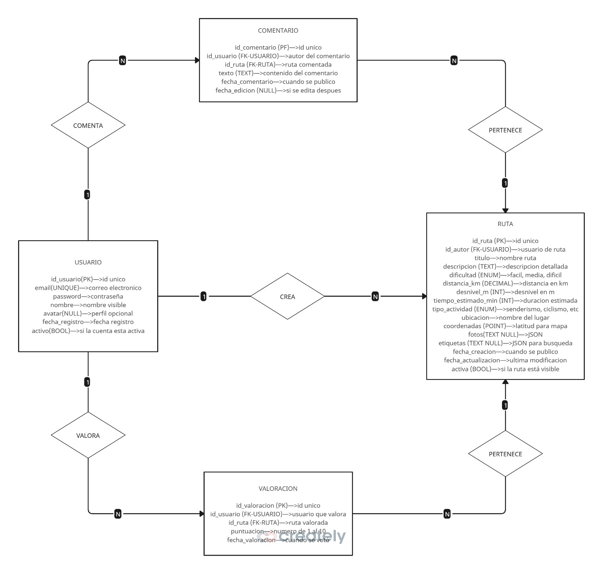

# **SendaLite**

## LOGO

  

**Descripción del logo:**

El logo representa una **chincheta de ubicación** sobre una **montaña**, simbolizando la idea de marcar rutas y destinos en entornos naturales.

## Integrantes

- **David Gragera Fernández** — DNI: 80085386F  
  

- **Shunya Zhan** — DNI: Y1346365M  
  

## Eslogan

*“Explora. Valora. Comparte”*

## Resumen

Aplicación web minimalista para amantes de la montaña, el senderismo y actividades outdoor en general.

## Descripción

La idea es que nuestra app, **SendaLite**, sea una aplicación web ligera y minimalista para descubrir y compartir rutas al aire libre, ya sea montaña o senderos.

Permitirá a los usuarios (según permisos):

- Consultar rutas clasificadas por **dificultad** (fácil, media, difícil).
- Ver detalles (distancia, desnivel y mapa).
- Valorar con una **puntuación del 1 al 10**.
- Crear, editar y eliminar sus rutas.

## Funcionalidades, Requisitos, “Pliego de condiciones”

### Ver listado de rutas

- La pantalla principal muestra todas las rutas disponibles en formato de **tarjetas o lista**.
- Cada tarjeta incluye información básica para facilitar una preselección rápida (título, dificultad, valoración media, kms).

### Filtrar rutas por criterios

- Filtrado por **fácil**, **media** y **difícil**, nombre, actividad y kilómetros.


### Ver ficha de ruta

Pantalla detallada con la información de una ruta específica, similar a una ficha técnica:

- **Título y descripción**.
- **Datos técnicos**: distancia, desnivel y tiempo estimado.
- **Galería de fotos**: Placeholder, no es funcional.
- **Información del autor**: nombre y avatar.
- **Historial**: fechas de creación/actualización.
- **Sistema de valoraciones**:
  - Solo usuarios registrados pueden votar.
  - Escala de **1 a 10** (10 es excelente).
  - **Puntuación media** calculada automáticamente y mostrada con estrellas + valor numérico.
  - Se muestra el número de valoraciones.
- **Comentarios**: listados bajo el encabezado "Comentarios".

### Registro e inicio de sesión (email + contraseña)

- Sistema de autenticación tradicional (email + contraseña).
- Tras loguearse, se habilitan acciones de creación/edición propias.

### Perfil de usuario

- Información pública: nombre visible y avatar (opcional/placeholder).
- Estadísticas: número de rutas creadas y valoraciones realizadas.

### Crear ruta (usuarios autenticados)

- Formulario con campos obligatorios y opcionales.
- Validaciones básicas en el servidor y en el cliente.

### Editar/eliminar rutas propias

- Solo el **autor** o el **administrador** puede editar o eliminar una ruta.

### Búsqueda por texto

- Motor de búsqueda simple por nombre, zona y palabras clave.


## Diagrama Entidad - Relación



## Casos de uso (resumen)

A continuación se muestran casos de uso principales, pensados para documentar el comportamiento esperado.

- Uso: Registrar usuario
  - Actor: Usuario no registrado
  - Precondición: Ninguna
  - Flujo principal: Usuario rellena formulario de registro -> sistema valida datos -> se crea la cuenta -> usuario puede iniciar sesión.
  - Excepciones: Email ya registrado -> mostrar error.

- Uso: Iniciar sesión
  - Actor: Usuario registrado
  - Flujo: Usuario envía email+contraseña -> sistema autentica -> crea sesión.
  - Excepciones: Credenciales inválidas -> mensaje de error.

- Uso: Crear ruta
  - Actor: Usuario autenticado
  - Flujo: Usuario rellena formulario de ruta (título, descripción, kms, desnivel, dificultad, coordenadas opcionales) -> sistema valida y persiste -> se muestra la ficha.
  - Excepciones: Campos obligatorios vacíos -> validación.

- Uso: Ver ficha de ruta
  - Actor: Cualquier usuario
  - Flujo: Usuario abre /rutas/{id} -> sistema muestra detalle, comentarios y valoraciones.

- Uso: Valorar ruta
  - Actor: Usuario autenticado
  - Flujo: Selecciona puntuación (1-10) en la ficha -> sistema persiste valoración -> recalcula media.
  - Excepciones: Usuario intenta votar varias veces (según política) -> se actualiza o se bloquea según implementación.

- Uso: Comentar ruta
  - Actor: Usuario autenticado
  - Flujo: Envía comentario en la ficha -> se persiste y se muestra bajo "Comentarios".

- Uso: Administrar usuarios/rutas
  - Actor: Administrador
  - Flujo: Accede a `/admin` -> lista usuarios y rutas -> edita o borra según necesidad.

## Conexión a la base de datos y datos de ejemplo

- Configuración principal: `src/main/resources/application.properties` contiene la configuración por defecto para la conexión JDBC.
- Por defecto el proyecto está pensado para usarse con MySQL local (o en Docker). En `docker/docker-compose.yml` y en `docker/mysql/init/` hay scripts para levantar MySQL y crear los esquemas/datos iniciales (`01_schema.sql`, `02_seed.sql`).

Propiedades típicas que están en `application.properties`:

- `spring.datasource.url=jdbc:mysql://localhost:3306/sendalite`
- `spring.datasource.username=sendalite`
- `spring.datasource.password=sendalite`
- `spring.jpa.hibernate.ddl-auto=update` 

Para pruebas unitarias y de integración se usa H2 en local en vez de SQL en Docker (configuración en `src/test/resources/application.properties`).

## Arrancar la base de datos con Docker (MySQL)

Este repositorio incluye un `docker-compose.yml` preparado para levantar una instancia de MySQL y Adminer para administración.

Pasos rápidos:

1. Arrancar los servicios:

```powershell
docker compose up -d
```

(o `docker-compose up -d` según versión de Docker)

2. Variables por defecto (fijadas en `docker-compose.yml`):

- MYSQL_DATABASE=sendalite
- MYSQL_USER=sendalite
- MYSQL_PASSWORD=sendalite
- MYSQL_ROOT_PASSWORD=root

3. El directorio `docker/mysql/init/` contiene los scripts `01_schema.sql` y `02_seed.sql` que se ejecutarán en el primer arranque y crearán la estructura y datos iniciales.

4. Para acceder a la base de datos desde Adminer: abre http://localhost:8081 y conéctate a `sendalite` usando las credenciales anteriores.

## Ejecutar tests

- Como hemos mencionado antes, los tests unitarios/DB usan H2 embebida (`@DataJpaTest`) por lo que no es necesario tener Docker corriendo para ejecutar `mvn test`.

- Ejecutar la suite desde la raíz del proyecto con el wrapper de Maven:

```powershell
.\mvnw.cmd test
```

## Ejecutar la aplicación Spring Boot (Maven)

Problema común: PowerShell puede responder "'.\mvnw.cmd' no se reconoce..." al ejecutar:

```powershell
.\mvnw.cmd spring-boot:run
```

Soluciones rápidas:
1. Asegúrate de estar en la carpeta raíz del proyecto (la que contiene `pom.xml`).
2. Ejecuta con el wrapper:

```powershell
.\mvnw.cmd spring-boot:run -DskipTests
```

3. Si no tienes wrapper pero tienes Maven instalado:

```powershell
mvn spring-boot:run -DskipTests
```

Helper incluido:
- `run-maven.ps1`: detecta `mvnw.cmd` o `mvn` y ejecuta `spring-boot:run` automáticamente.
  Uso desde la raíz del proyecto:

```powershell
.\run-maven.ps1
```

## Notas rápidas sobre cambios en la "UI"

Se han aplicado diversas mejoras front-end para hacer la ficha de ruta más clara y agradable visualmente. Resumen de lo incluído:

- Avatares genéricos: `src/main/resources/static/img/avatar-default.svg`.
- Valoración media mostrada con estrellas + número.
- Botón de subida de foto (placeholder) visible sólo a usuarios autenticados; actualmente no sube archivos al servidor.
- 'Leer más' en descripciones largas.
- Logo con fallback: el navbar intenta cargar `static/img/logo/logo.png` y usa texto `SendaLite` si no se encuentra.
- Padding lateral global para evitar que el contenido esté pegado al borde.
- Comentarios y valoraciones mostradas bajo sus respectivos encabezados en la ficha.

Estos cambios son mayormente front-end y no alteran la lógica de persistencia salvo en el caso de valoraciones, que utilizan los endpoints existentes.

## Estado de implementación 

- Implementado:
  - Listado de rutas, fichas, búsqueda y filtrado por dificultad.
  - Registro/login, creación y edición básica de rutas por su autor.
  - Valoraciones y cálculo de media.
  - Panel de administración con recuento de usuarios y rutas y enlaces para editar.
  - Mejora visual: avatares por defecto, padding lateral, orden de comentarios/valoraciones.

- No implementado / parcial:
  - Subida real y persistente de fotos (actualmente placeholders en cliente).
  
  - Integración avanzada de mapas (trazado interactivo).


## Pruebas y verificaciones 

- Logo: debe aparecer en el navbar tanto si estás autenticado como si no. Si no ves la imagen, comprueba `img/logo/logo.png` y que la carpeta `img/` se incluya al subir el proyecto.
- Panel admin: en `/admin` verás el recuento de usuarios y rutas y enlaces para editar.
- Ficha de ruta: comentarios y valoraciones aparecen bajo sus respectivos encabezados.
- Subida de foto (placeholder): estando autenticado, pulsa el botón y selecciona un fichero — aparecerá el selector pero no se subirá al servidor.

## Archivos y cambios front-end relevantes

- `src/main/resources/templates/fragments/common.html` — manejo del logo con fallback a texto.
- `src/main/resources/templates/index.html` — lista de rutas y estrellas de valoración.
- `src/main/resources/templates/ruta.html` — ficha de ruta: layout, placeholders, comentarios/valoraciones.
- `src/main/resources/static/css/style.css` — ajustes de padding, estilos para avatar y estrellas.
- `src/main/resources/static/img/avatar-default.svg` — avatar por defecto.


## Cómo contribuir al proyecto (mejoras que nos faltan por implementar)
- Implementar subida real de imágenes (endpoint multipart + almacenamiento + persistencia de ruta en la entidad) y documentarlo con la propiedad `app.upload.dir`.
- Añadir validaciones de tamaño/tipo y generación de thumbnails.
- Mejorar responsive y accesibilidad de la ficha de ruta.

## Endpoints disponibles (vistas y API)

A continuación se listan las rutas HTTP principales que están implementadas en el proyecto (según los controladores actuales). Incluye endpoints que sirven plantillas Thymeleaf (vistas) y endpoints REST (`/api/**`).

Rutas de vistas (Thymeleaf):

- GET /                — listado de rutas (index)
- GET /rutas/{id}      — ficha de una ruta (detalle)
- GET /login           — formulario de login
- GET /register        — formulario de registro
- GET /admin           — panel de administración (resumen)
- GET /admin/usuarios  — listado de usuarios (vista admin)
- GET /admin/usuarios/{id}/editar — formulario edición usuario (admin)
- GET /admin/rutas     — listado de rutas (vista admin)
- GET /admin/rutas/{id}/editar — formulario edición ruta (admin)
- GET /ruta_form       — formulario de ruta (crear/editar) — usado por admin y usuarios cuando corresponda

API REST principales (JSON):

- POST /api/rutas                 — crear ruta (autenticado)
- GET  /api/rutas                 — listar rutas (soporta ?q=busqueda)
- GET  /api/rutas/{id}            — obtener detalles de ruta (incluye autor, comentarios, valoraciones)
- PUT  /api/rutas/{id}            — actualizar ruta (autor o admin)
- DELETE /api/rutas/{id}          — borrar ruta (autor o admin)

- POST /api/usuarios              — crear usuario (registro via API)
- GET  /api/usuarios              — listar usuarios
- GET  /api/usuarios/{id}         — obtener usuario
- PUT  /api/usuarios/{id}         — actualizar usuario
- DELETE /api/usuarios/{id}       — eliminar usuario (su propio usuario o admin)

- POST   /api/rutas/{rutaId}/comentarios    — crear comentario (autenticado)
- GET    /api/rutas/{rutaId}/comentarios    — listar comentarios de una ruta
- PUT    /api/rutas/{rutaId}/comentarios/{comentarioId} — actualizar comentario (autor o admin)
- DELETE /api/rutas/{rutaId}/comentarios/{comentarioId} — eliminar comentario (autor o admin)

- POST   /api/rutas/{rutaId}/valoraciones   — crear/actualizar valoración (autenticado)
- GET    /api/rutas/{rutaId}/valoraciones   — listar valoraciones
- GET    /api/rutas/{rutaId}/valoraciones/avg — obtener media de valoraciones
- DELETE /api/rutas/{rutaId}/valoraciones/{valoracionId} — eliminar valoración (autor o admin)

Ejemplos rápidos (PowerShell / curl):

- Listar rutas (GET JSON):

```powershell
curl.exe -H "Accept: application/json" http://localhost:8080/api/rutas
```

- Obtener detalles de una ruta (GET JSON):

```powershell
curl.exe -H "Accept: application/json" http://localhost:8080/api/rutas/1
```

- Crear valoración (POST JSON) — requiere autenticación (cookie o token):

```powershell
curl.exe -X POST -H "Content-Type: application/json" -d '{"puntuacion":8}' http://localhost:8080/api/rutas/1/valoraciones
```

Nota: La autenticación para los endpoints que lo requieren se maneja con el sistema de sesiones de Spring Security; desde curl es más fácil probar con herramientas como Postman o simulando el login y enviando la cookie de sesión.

---


